# The atlas on the phone · art review and proposals

A review of how Orbit looks, done on 2026-09-23 against the shipped Renaissance atlas (era V) at the
reference sheet, 430×932. It adds to [`ART-AUDIT-TODO.md`](../ART-AUDIT-TODO.md) rather than
repeating it. That audit judged the plate by its **historical claim**: is this what a 1603 copperplate
would carry? Most of it is now closed. This review asks a different question: **what does a player
holding a phone actually see, second by second, and where does it fall short of the plate the code is
capable of?** Where a proposal here overlaps an item still open in that file, the item is named.

Nothing here builds toward the archived era progression. Era II is touched on only where it shares a
problem with the atlas. Era I, The Rock, is reviewed in its own section
([R](#r--era-i-the-rock-on-its-overhaul-branch)) against its overhaul branch,
`claude/stone-age-deck-overhaul-ibtaij`, since what `main` shipped of it at the time was out of date. (That
branch has since merged to `main`, in pull request #74.)

## How it was looked at

Headless Chromium at 430×932, device scale 2, served from `src/`. Runs were flown by a small
autopilot built on `world.aim()`, the same way `scripts/probe.mjs` flies them: release on the first
frame the oracle reports a clean perfect. The ledger was seeded with the whole catalogue (the
`FULL_LEDGER` fixture from `verify.mjs`) so unlocks and scenery could be switched on. The same set of
frames (frontispiece, then 1.5 s to 100 s into a run, then the colophon) was taken for four setups:
night plate, paper plate with chapter plates, night plate with chapter plates, and the Era II door.
The frames used below are in [`art-review/`](art-review/).

## The short verdict

The **materials** are excellent: the specimens, the burin line, the vortex, the wind-head, the pen,
the laid paper, the trail inks. The weak points are in how everything is **arranged**, not in how
each piece is drawn:

1. **Most of the time the screen is nearly empty, and when it fills up it fills with text.** An
   unobserved body is a dot inside a ring (a deliberate design choice), so the chart is dark space
   with small points in it. Once landings start, each one writes three or four separate notes, and
   those notes are the brightest things on the sheet.
2. **There are real defects in the lettering.** Some labels collide, some are clipped by the frame,
   and the geometer's point letters grow into strings like `mmmmmmm`.
3. **A few pieces are drawn in a noticeably weaker hand than the rest**: the Leviathan, the paper
   plate's flood edge, the frontispiece menu, the impressum. Next to the specimens they look like
   placeholders.
4. **The screen rarely reacts.** A capture, a perfect, a constellation and a death all land with
   roughly the same visual weight. The art already contains the vocabulary for a stronger response
   (ink, the press, the paper). It just isn't used at those moments.

None of this needs a new renderer. One targeted GPU layer would help with a specific list of
effects (see [Renderer](#should-there-be-a-new-renderer)).

## What has been fixed since

Built on `claude/games-art-audit-p5nt2z`, `npm test` green, checked at 430×932:

| Item | State | What changed |
|---|---|---|
| A1 survey letters | Fixed | Past `z` a letter takes a prime (`a'`, `a''`, `a'''`, then round again) instead of doubling; a soft clearing replaces the dark box (`effects.js` `surveyLetterName`, `surveyLetter`) |
| A2 caption collisions | Fixed for node captions | A node's side caption takes the west side when the east would cross the frame or a note, and drops to a hairline when neither is clear (`figures.js` `drawNode`). The `verify.mjs` check is the A2 text-box row below |
| A3 one landing written four times | Fixed | The construction no longer repeats gain, speed and the square's bonus; the tally and the orbit's note carry them (README updated) |
| A4 paper flood edge | Fixed | Stain pools feathered, weakened and seated on the front; corrosion feathered; the running head's ground fades at its ends and holds over the ink |
| B2 loud tallies | Fixed | Older tallies dry to half strength once a later landing is written |
| B3 pen lost in flight | Fixed | A soft reserve of the ground under the pen |
| B1 empty sheet | Fixed | Unobserved catalogue stars are set out in sanguine chalk at their own magnitude sign under the ink prick; an unobserved world gets a chalk trial circle at its true size and, at night, a star sign of the class its size earns. The chapter plate's line now carries the channel too (B4) |
| B4 soft chapter plates | Fixed | Plates are baked at the density they are shown at (capped 1.66×, two held). Down the channel only the plate's line is printed, at 0.55, from a second tone-free pull joined into the cached plate; the flat veil is gone, and the next plate is baked a stage a frame before its turn |
| F screenshot harness | Built | `tools/shots` (`npm run shots`). The `sheet` scenario covers B1/B4 with the chapter plates on; `press` forces D1, D4 and D5 on night and paper. The text-box check is the A2 row below |
| C3 printer's device | Fixed | An armillary sphere in a double-ruled oval with laurel, at the left of the impressum's first rows (`drawPressDevice`) |
| C5 colophon shows the plate | Fixed | The end leaf carries the whole run in miniature above FINIS, replayed from its log and folded into up to four strips (`paintEndMiniature`, review.js); dropped first on a leaf too short for it |
| D2 blind embossing | Fixed | Every captured ring keeps an uninked relief (lit upper left, shadowed lower right) — two plain arcs a ring, drawn with the press's other marks |
| D6 page curl | Fixed | The rising sheet's corner is turned back (underside, fold, shadow; the old plate shows through) and flattens as it lands |
| D7 nova across the plate | Fixed | At full charge the star's spokes are struck once more as long rays across the chart, clipped to the inner rule, drying in 0.85 s |
| D9 foxing that grows | Fixed | Paper only: spots and a tide mark spread in six stages (30 s, then each minute), each baked once; the review shows the age the run reached |
| D10 wet-ink sheen | Fixed | Night only: the trail's last 0.28 s carries a narrow glint along its crest, drying away; off under reduced motion |
| D11 haptics | Fixed | `navigator.vibrate` on capture (10 ms), perfect (double) and death (34 ms), on every plate, off under reduced motion |
| A2 text-box check | Fixed | `groundCollisions()` (ground.js) and a `verify.mjs` assertion that no two pieces of settled type overlap in the runtime playthrough, now rendered at the page's own 60 fps. It found four real clashes, all fixed: a new chapter title set over the last one's (`revealAnchor` excused every title, not just its own); a title and a note choosing the same line in the frame the chart opens; and a standing instruction and a landing's tally each choosing a line the other took a frame earlier. The title and note solvers and the tally's line now ask the live title, notes and tallies directly as well as the one-frame-old register. The chapter prints' captions now register as `legend` ground, so node captions step round them |
| C1 frontispiece as a web form | Fixed | The menu stands on the sheet wiped clean through a soft oval, ruled as a table of contents |
| C2 Leviathan | Fixed | Redrawn as an engraved sea monster |
| C3 cartouches | Fixed | The impressum and the chapter title stand in one strapwork cartouche (`src/press.js`): notched strap, scrolls at the ends, lozenges at head and foot. The printer's device inside the impressum is still open |
| C4 plate tone | Fixed | Wiping streaks and edge film cut into the cached frame layer, clipped to the plate mark; the paper vignette lightened to match |
| D1 press strike | Fixed | A perfect transfer sets the sheet down 1 px for 80 ms and embosses the landing ring (lit and shadowed offset strokes) for 0.95 s |
| D4 second colour pass | Fixed | A completed figure is inked again in one left-to-right sweep, rubric red on paper and gold at night, off register, settling and drying over the completion's 2.4 s flash |
| D5 death blot | Fixed | A hazard death on the atlas blots the page with the run's own ink, flung away from the nearest hazard, instead of bursting |

Built on `claude/remaining-art-assets-6bf6v4`, with everything new in `src/press.js` and one-line hooks
elsewhere, so it merges cleanly with the Era I overhaul (`claude/stone-age-deck-conflicts-g0en46`).
The eras never reach any of it: they draw their own frame, and the event hooks ask `renaissanceAtlas()`.

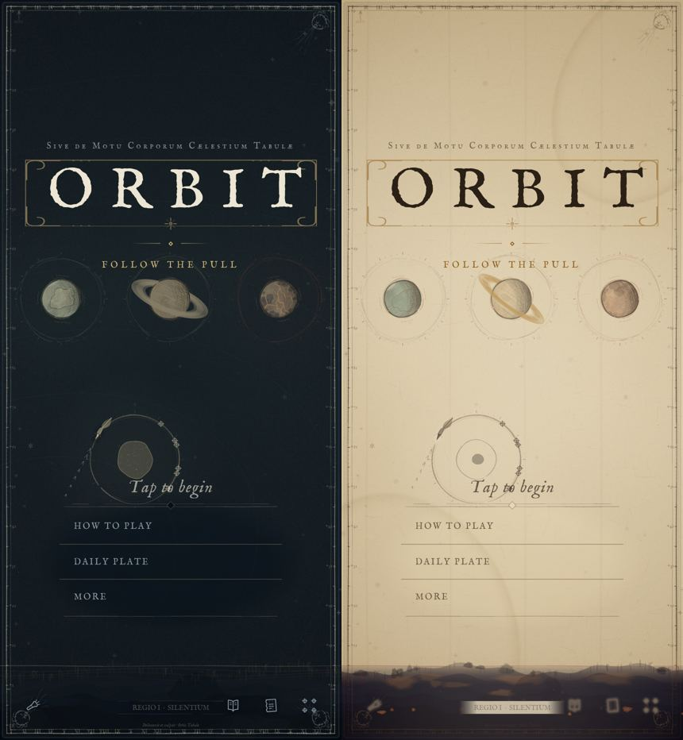
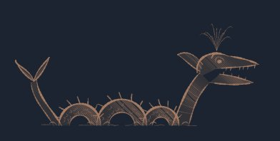
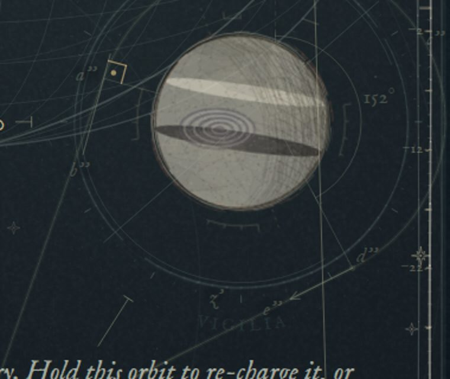
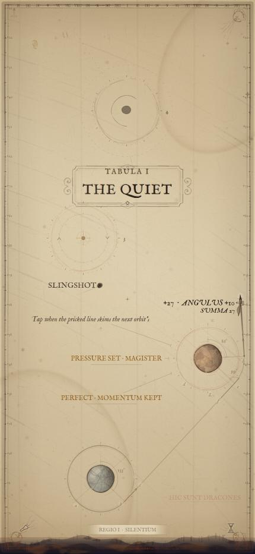
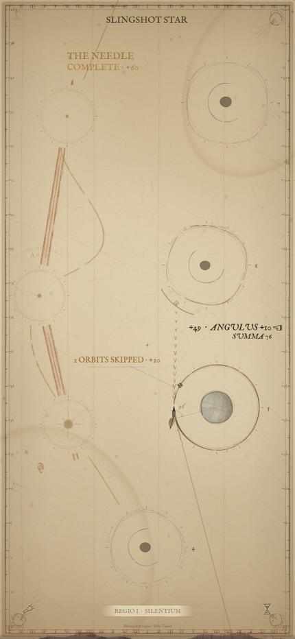
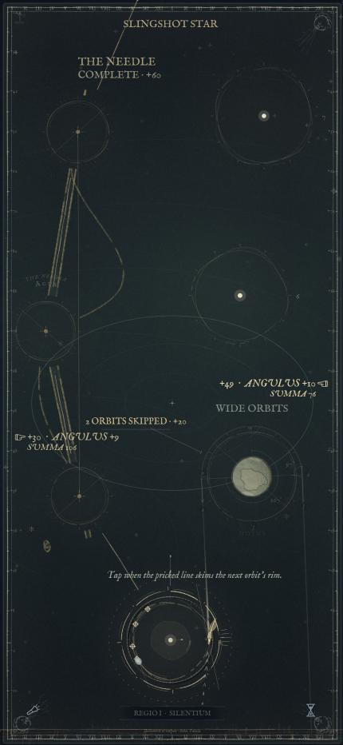
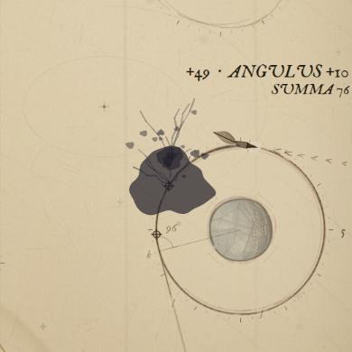
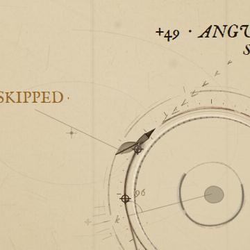

---

## A · Defects to fix first

These are bugs rather than matters of taste. Each one is visible in an ordinary run.

### A1. Geometer's letters grow without limit (`effects.js` `surveyLetterName`)

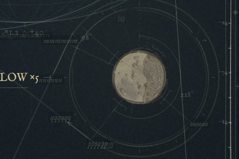

`surveyLetterName(n)` repeats the letter `floor(n/26)+1` times, and every flight uses six letters
(three for the departure, three for the landing). So doubled letters appear from about the fifth
transfer, and by row 28 the chart reads `mmmmmmm`, `qqqqqq`, `PPPPPP`. Each string also sits on a
`fillRect` of the ground colour at 0.7 (`surveyLetter`), which on the night plate prints as a dark UI
chip rather than a clearing in the engraving.

*Fix.* Mark each pass through the alphabet with primes instead of repeats: `a`, then `a′`, then
`a″`, then `a‴`. That is how a geometer marks a second figure. Or restart the letters at `a` each
region, since old constructions have left the sheet by then anyway. Replace the rectangle with a
soft-edged reserve (a radial clear, or three offset strokes of ground colour under the glyph), which
is how an engraver leaves paper under a letter.

### A2. Labels still collide, and some are clipped by the frame

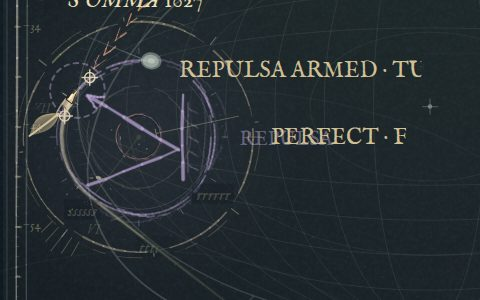

- `AURORA` (a node caption riding its star) prints through `ORBIT SKIP` (a note), giving
  `AURORBIT SKIP`. The same thing happens with `REPULSA` under `PERFECT · FLOW`. The register in
  `ground.js` lets passing type be "stepped around but never worth silencing a note for", but a
  caption that fails to find clear ground is still drawn. It should step, and if it can't, fade to
  a hairline while it overlaps.
- A node caption was set outside the inner rule at the top right (`AU…`, `03-deep-run`). Era II
  shows the same fault: `+47 · TRUE ENTRY +9` is cut off at the right edge.
- `THE DEEP` is set right on top of the flood and the footer band in the same frame. It is legible,
  but it collides with the waterline.

*Fix.* Every caption solver should clamp to the inner rule, as inscriptions already do. Add one check
to `verify.mjs`: for any frame, no two registered text boxes intersect and none crosses the inner
rule. The register already holds the boxes, so this is cheap to assert.

### A3. One landing writes the same thing three or four times

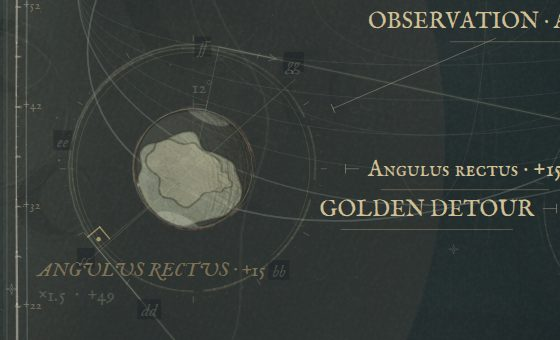

A single square landing produced:
- the gutter tally `+49 · ANGULUS +15 · ×1.5 / SUMMA 251`,
- the construction note `×1.5 · +49`,
- the italic `ANGULUS RECTUS · +15` beside the construction,
- the small-caps inscription `Angulus rectus · +15` on the orbit,
- and `OBSERVATION · Angulus rectus` further up.

That is five text objects for one event, which is why the sheet reads as a spreadsheet at depth.
*Proposal:* the tally is the score and stays. The construction keeps only its **numerals**: the
angle and the right-angle mark, and no points. The orbit inscription is dropped when a tally has
already said the same thing. An observation is written once, the first time.

### A4. The paper plate's flood edge reads as rubble

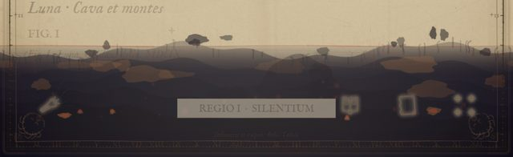

On the paper frontispiece the rising ink's shoreline is a row of dark flat-shaded chips floating
above the line, with copper blotches that have hard vector edges. It looks like a pile of rocks, not
iron-gall bleeding up along the fibres as the README describes. The footer controls and
`REGIO I · SILENTIUM` sit inside it on a flat grey rectangle and are nearly unreadable.
*Fix:* drop the floating chips on paper. Give the shoreline the capillary fringe (see D3), and give
the footer label a paper reserve instead of the grey box.

---

## B · Readability and hierarchy on the phone

### B1. The sheet is empty for most of a run

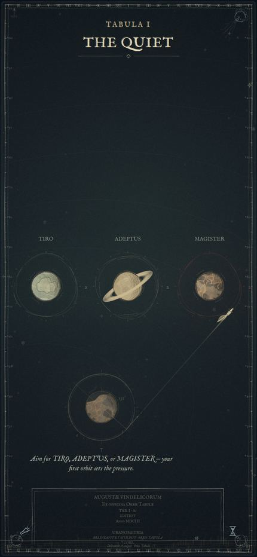

In the opening frame, the top half of the phone is blank indigo. In a mid-run frame
(`03-deep-run`), about 60% of the play channel holds nothing but graticule. What the player sees
most is **unobserved bodies**: a bright dot inside an unfinished ring. That is the right idea (a
phenomenon, not yet a specimen). But at 430 px wide, a dot does not read as a *thing that will be
worth drawing*.

*Proposals*, in order of cost:
1. **Give each phenomenon its magnitude form.** Draw an unobserved body with the star punch its size
   and family would earn (the six MAGNITUDINES forms already exist in `figures.js`) instead of a
   plain dot with a halo. That gives a sky of real star signs, and big bodies look big before they
   are drawn.
2. **A chalk sketch of the body under the ring**: the sanguine trial circle the paper plate already
   uses for keylines, at the body's true radius, with two or three hatch strokes. It says "a world
   goes here" without giving away the specimen.
3. **Let the chapter plate carry more of the channel.** At the moment the whole distance is off by
   default (`scenery: none`), and when it's on, the channel wash knocks it back hard. See B4.

### B2. The notes are the loudest thing on the sheet

The gutter tallies (`+39 · ANGULUS +12 · ×1.2 / SUMMA 841`) are set large, in bold italic, near
white. They outweigh the traveller, the orbits and the specimens. For a game whose whole premise is
an engraved chart, the score should read like marginal type, not like a HUD.
*Proposal:* print tallies one step down in weight and in the margin ink, not the highlight ink. Set
only the newest tally at full strength and let older ones dry to the route's own dried tone. This is
the same wet-to-dry logic the trail already uses, so it fits the material.

### B3. The traveller is small and gets lost in flight

At the reference size the quill is about 25 px long and drawn in the same pale ink as the orbits and
the graticule. On a long transfer across the graticule it disappears among the lines. The
wet-ink bead is its most legible part.
*Proposal:* keep the drawing, but give the pen a **reserve**: a narrow halo of clean ground colour,
the same trick the paper plate already uses to separate the pen from the vane. Use it on every
plate, and make the wet trail's first 40 px a step darker/brighter than everything else on the
sheet. Nothing else should use the highlight ink while the player is in flight.

### B4. The chapter plates are soft and muddy when switched on

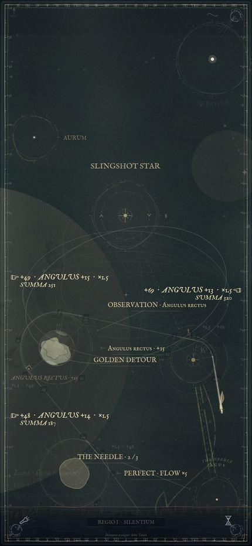

The Quiet's monumental moon, seen through the channel wash, becomes a flat grey disc covering a third
of the phone and sitting behind every orbit. Two causes:
- The illustrations are cached at a fixed **720×1200** (`celestial.js`), while the reference sheet
  at the capped DPR of 2 is **860×1864** device pixels, and 1290×2796 at the phone's real DPR of 3.
  They are always upscaled, so the engraved hatching of the moon turns into grey fog.
- The channel wash is a flat veil of the ground colour, which lowers contrast but leaves the big
  shape's value. A dark disc under a veil is still a disc.

*Proposals:* cache the chapter plates at sheet resolution (they're baked once per chapter, so the
memory cost is about 4 × 860×1864 × 4 B ≈ 25 MB at DPR 2; bake only the current plate and the next
one to halve that). In the channel, **drop the wash and the tone and keep the line**: print the
illustration's hatching at reduced weight, with no fill. An engraving behind a chart reads because it
is line, not tone.

### B5. The DPR cap costs the hairlines

`resize()` clamps `DPR` to `[1.5, 2]`. The whole look depends on sub-pixel burin hairlines, and on
the target phone (DPR 3) every one of them is drawn at 2× and then scaled by the browser. That is why
the ring hairlines and the graticule look slightly soft in device screenshots.
*Proposal:* allow DPR 3 on small viewports (where `W*H` is phone-sized, the pixel count at 3× is
close to a laptop at 2×). Keep the caches (laid paper, chapter plates, dust) at 2× if memory is the
concern, since those are textures, not lines. This needs a measurement on a real device, because
headless timing is software raster (see Renderer).

---

## C · Art direction: making it fit and making it better looking

### C1. The frontispiece is a web page on top of a plate

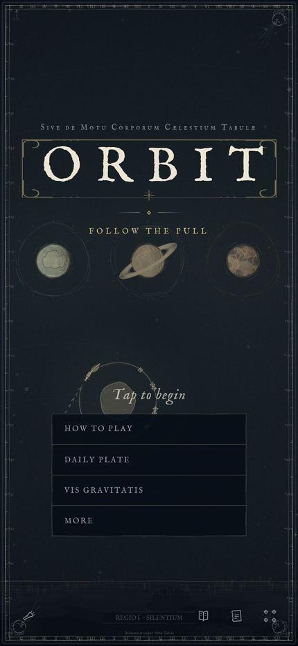

The title cartouche and the three worlds are strong. Below them, four full-width dark rectangles
(`HOW TO PLAY`, `DAILY PLATE`, `VIS GRAVITATIS`, `MORE`) sit on top of the first node, cut its orbit
in half, and print `Tap to begin` across the body. It is the least period-looking thing in the game,
and it's the first thing anyone sees.
*Proposal:* set the choices as a **printed table of contents**: a ruled list in the Fell small caps
with dot leaders and folio numbers (`Tabula diei ........ ii`), inside the plate, without a filled
background. Move it below the first orbit so the node stays whole. The same treatment applies to the
colophon's three bottom buttons, which are already closer to it. (Overlaps
`ART-AUDIT-TODO` "The catchword as the way out of every leaf" and Mair's architectural title page
under "Sources".)

### C2. Redraw the Leviathan in the burin

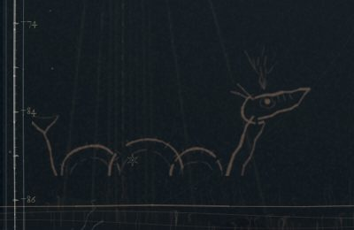

It is currently four uniform-width arcs, a stick tail and a sketched head: a doodle next to the
hatched specimens. The sea monsters of Olaus Magnus's *Carta Marina* (1539) and Ortelius are the
model: a scaled body with **hatched shading on its underside**, fins drawn with a swelling line, a
spout as a fan of fine strokes. It's baked once into a sprite (`leviathanSprite`), so a richer
drawing costs nothing per frame. The same goes for the **sea-monster frame ornament** unlock, which
shares the pigment.

### C3. The impressum and the chapter title want cartouches

The impressum at the foot of the opening sheet is a plain rectangle with centred small text, so it
reads like a website footer. The chapter title has a blurred leaf behind it. Both are already open
in `ART-AUDIT-TODO` ("A strapwork cartouche for the impressum", "A strapwork cartouche for the plate
title"). They are listed here because at phone size they're the largest ornamental objects on
screen, so they're worth doing before any wide-screen marginalia.

### C4. One plate-tone pass over the whole sheet

Night and paper both finish with a vignette. A real impression has **plate tone**: the thin film of
ink the printer did not wipe off, heavier toward the plate edges, streaked in the direction of the
wiping hand. One cached, seeded texture multiplied over the finished frame (the laid-paper tile is
already composited this way) would do more to make the sheet feel printed than any single ornament.
It's open in `ART-AUDIT-TODO` as "Plate tone: the printer's wiping streaks". This review would move
it to the top of that list.

### C5. The colophon should show the plate that was flown

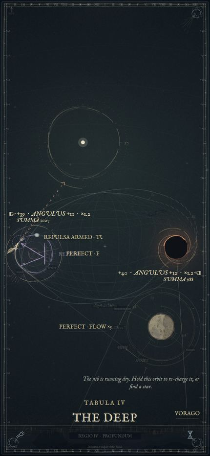

The end screen is a fine typographic leaf, but it covers the chart the player just drew. The run has
a replay (`replayRun`, `review.js`), so the colophon could carry a **thumbnail of the whole finished
plate**: route, captured specimens and figures, drawn small in a plate-mark on the leaf. That is the
trophy of a run, and it's also the image people would screenshot and share.

### C6. Era II

- **Era II (The Ceiling)** is bold and readable after the overhaul, but its pylons, doors and
  frieze are flat vector shapes with no ageing. A single plaster texture (flaking, a dust wash, the
  soot bloom that Theban ceilings actually carry) over the whole painted layer would bring it closer
  to the craft level of the atlas. Its red captions still clip at the right edge (see A2).

---

## D · Effects that could be added

All of these stay inside the one rule the atlas already keeps: **nothing emits light, everything is
ink, paper or the press**. Each respects pause and reduced motion the way the current effects do.

| # | Effect | Moment | What it looks like | Where | Cost |
|---|---|---|---|---|---|
| D1 | **The press strike** | Perfect transfer | For 80 ms the whole sheet shifts 1 px down-right and back, and the landing's ring prints with a heavier embossed edge (a light and a dark offset stroke), like the plate biting harder. | `frame.js` compose; ring bake in `marks.js` | S |
| D2 | **Blind embossing** | Every capture | The captured orbit's ring leaves a faint *uninked* relief groove (a highlight line one side, shadow the other) that stays on the sheet. It turns the route into a relief the player can see at a glance. | cached per node like the dried route | S |
| D3 | **Ink bleed along the fibres** | The flood's shoreline, the release blot | The edge of the dark grows along the chain-line direction in capillary fingers, with a darker tide line where it has dried. This replaces the chips on paper (A4). | `drawDark`; a shader makes this far cheaper (see E) | M |
| D4 | **A constellation printed as a second colour pass** | Constellation completed | A second plate is registered over the figure: the whole Hevelius figure is inked in one sweep in the rubrication red (or gold at night), 1–2 px off register, then settles. This makes the biggest reward in the game the biggest visual event in it. (Overlaps "The completion vignette".) | `drawConstellations` completed branch | M |
| D5 | **The page blots when the run ends** | Death | Instead of a burst, a large splat of the run's own ink spreads from the traveller, soaks into the sheet with `inkSplat`, and the colophon leaf is laid over it. (Overlaps "The mark the dark leaves".) | `ui.js` death branch, `inkSplat` | S |
| D6 | **A paper curl on the page turn** | Chapter change | The rising sheet shows a lifted corner with a soft shadow and a highlight along the fold, instead of a flat slide. | `drawChapterReveal` | M |
| D7 | **The slingshot as a nova on the plate** | Full charge | When the stella nova bursts, its spokes are struck *outward across the chart* for one frame, as long burin rays that fade to dried ink. The star is the only mark allowed to cross orbits. | nova painter in `figures.js` | S |
| D8 | **A continuous vortex whirl** | Always, near a vortex | The sheet winds smoothly into the eye with no band seams and more turn near the centre. The current 16 clipped annuli are limited to 0.62 rad because of visible steps (see the comment above `SWIRL_TURN`). | needs the GPU pass (E) | M |
| D9 | **Foxing that grows** | Over a long run | On paper, foxing spots and a tide mark slowly spread with time spent on the chart, so a 3-minute run literally looks older at the end than at the start. | backdrop cache; a few re-bakes per run | S |
| D10 | **The wet-ink sheen** | Trail head, fresh lettering | On the night plate, the last few frames of wet ink carry a narrow specular glint that runs along the stroke and dries away. It is the one "light" ink really has. | trail painter | S |
| D11 | **Haptics** | Capture, perfect, death | `navigator.vibrate` where supported (Android). A 10 ms tick on a capture, a double tick on a perfect. Free on the reference phone's Android equivalents, and no-op on iOS. | `ui.js` event handler | XS |

The priority order is D1, D4, D5, D2 (they cover the four moments that matter, and none needs new
infrastructure), then D3 and D8 once the GPU pass exists.

---

## E · Should there be a new renderer?

**Not a replacement. One small optional GPU compositing pass would be worth it.**

**Why Canvas2D should stay the renderer.** Everything this game draws is path-stroked line work and
text: burin strokes with swelling width, glyph outlines stroked on by dash offset, curved lettering,
clip masks for the living pen. Canvas2D is exactly the right tool for that. A WebGL/WebGPU rewrite
would have to rebuild line tessellation with variable width, text shaping and clipping from scratch,
across 16 000 lines of dense painter code. It would lose the direct correspondence between the
README's craft descriptions and the code, and it would break `verify.mjs`'s headless runtime checks,
which drive the page with Canvas2D stand-ins. Measured in headless Chromium, the JavaScript side of a
frame (all the `draw*` calls) is about 5 ms. The rest of the frame time is rasterisation of the
composite, which a GPU-accelerated Canvas2D on the phone already does on the GPU. There's no
performance case for a rewrite.

**Why a thin GPU pass on top would pay off.** A handful of the effects above, and some that already
ship, are *per-pixel* operations that Canvas2D can only fake:

- the vortex whirl (D8): today it's 16 clipped, rotated `drawImage` bands with a known seam limit;
- ink bleed and capillary fringes (D3), and the flood's edge in general;
- plate tone and wiping streaks (C4) applied as a multiply with a displacement;
- the off-register colour of a rough landing, currently done by redrawing;
- the embossed relief (D2) as a normal-mapped highlight;
- the Sepia plate's per-pixel tint of each planet layer (`plates.js` `getImageData`/`putImageData`).

The shape of it: keep `canvas` as the 2D drawing surface. Add one WebGL2 canvas stacked above it
that, each frame, takes the 2D canvas as a texture (`texImage2D` from a canvas is a GPU-to-GPU copy
where the canvas is accelerated) and draws one full-screen quad through a fragment shader that
applies the sheet effects: the swirl field of every visible vortex as uniforms, a plate-tone
texture, a paper normal map for emboss, and the flood's distance field for bleed. If WebGL2 isn't
available, or `verify.mjs` is running, nothing changes: the 2D canvas is shown as it is today, and
the effects fall back to their current Canvas2D versions. No dependency is added (WebGL is a native
API), so the no-external-resources rule in `build.mjs` still holds.

Suggested order: first measure the phone (Safari Web Inspector timeline, 60 s of play at depth) to
establish the baseline. Then build the pass with the vortex whirl only, since it's the one effect
with a measurable quality limit today. Extend it only if the frame cost on the device stays under
about 2 ms.

---

## F · Other improvements

- **A visual regression harness.** `npm test` can't see any of the problems in section A. The
  autopilot this review used is about forty lines on top of Playwright (it would be a dev
  dependency, like `fontkit`, and never shipped). A `scripts/shots.mjs` that flies three seeded runs at
  430×932 and writes frames to a folder (not a test, a tool like `probe.mjs`) would make every art
  change checkable at the reference size in one command. Adding the "no two text boxes intersect"
  assertion (A2) to `verify.mjs` catches collisions without a browser.
- **One motion language.** The reveal, the page turn, the notes and the colophon each ease
  differently. Pick two curves (a "pen" ease-out for anything drawn, a "press" ease-in-out for
  anything that moves the sheet) and use only those.
- **Light the key moments with sound and picture together.** Captures, perfects and constellations
  already have tones (`audio.js`). D1, D4 and D5 should be timed to hit on those tones so the
  audio and the picture land together.
- **Colour budget for the night plate.** Night is almost monochrome: pale ink, gold, a little copper.
  The hand-coloured specimens are the only colour, and they're dimmed until observed. One more accent
  reserved for *reward* (the rubrication red, used only for constellations, records and the nova)
  would make those moments readable at a glance.
- **Accessibility of the lettering.** The marginal italic at 12–13 px on the night plate is at the
  edge of legibility on the phone. The tallies are huge and the instructions are tiny, when it should
  be the other way round.

---

## R · Era I, The Rock, on its overhaul branch

Flown at 430×932 on `claude/stone-age-deck-overhaul-ibtaij` (head `119db8a`), against its own plan,
`docs/ROCK-OVERHAUL.md`. The direction chosen there (the torch in the dark) is working: the triad on the
frontispiece (the crescent with its tally notches, the soliform, the rayed star) is the best-drawn thing
in the era, the tally HUD with hand stencils reads at a glance, and the chasm reads as a real drop.
What holds it back is mostly the wall bake, plus the lettering problems the atlas also has.

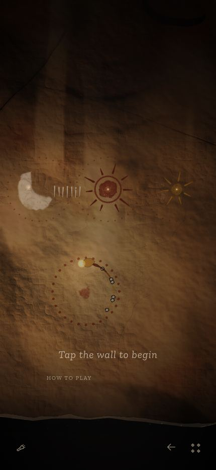
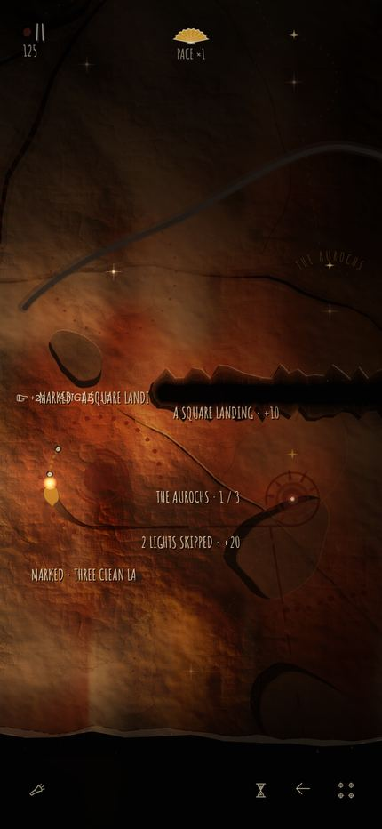
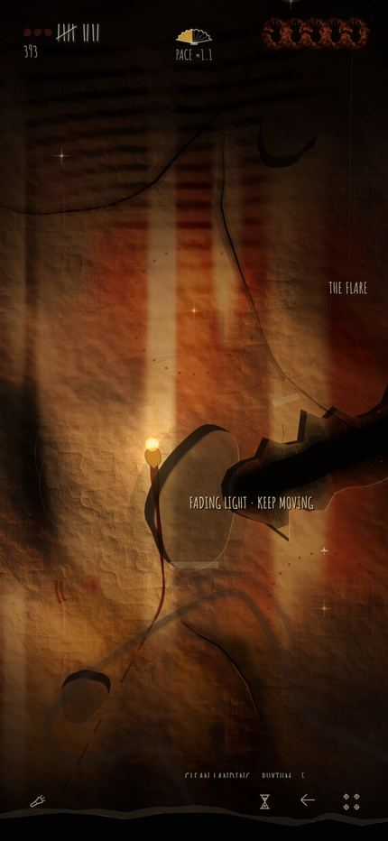
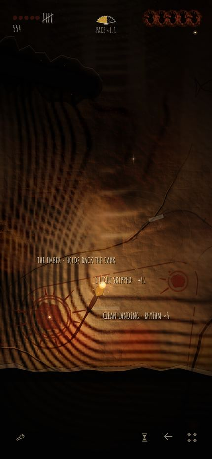

### R1. The flowstone reads as stage lights (`rock.js`, field 25 of the face bake)

Deep into a run the wall carries bright vertical columns with hard sides, evenly spaced, like light
through a curtain (`13-rock-flowstone`). They are the flowstone streaks. The field is sampled as
`fx=wx/34, fy=wy/9/34`, so every streak is one lattice cell wide, and all of them stand on the same
34-unit grid. `rockStep(.55,.75,…)` then cuts each one with a hard edge.
*Fix:* warp x before sampling (add a low-frequency noise offset of about ±20 units that drifts with y),
vary the width by a second field, and widen the step to `.5–.85` so a streak fades out at its sides.
Real flowstone is also brighter and glossier at the top of a run and fades downward; multiplying by
a 0–1 ramp along each streak's length would give that.

### R2. Bedding planes turn into moiré (`rock.js`, the `saw` term)

In `14-rock-moire` the wall is covered by concentric bands and a checker pattern. The bedding term is a
sawtooth with a period of 64–120 world units, lit by the height gradient at `(shade-.5)*230`. Where two
fields align it becomes a regular grating, and with the flowstone columns on top it beats into a
checkerboard. *Fix:* cap the bedding contribution to the shading (it's the gradient of a sawtooth, so
the lit lip is as strong as a real ledge everywhere), jitter the period per bed, and keep the mask
`rockStep(.62,.8,n16)` from covering more than a small fraction of a screen.

### R3. Notes collide with the tally and with each other

`12-rock-notes`: `+2…` (the gutter tally) prints under `MARKED · A SQUARE LANDING`, and a note set beside
the chasm runs into it. The wall's notes go through the same register as the atlas's, so this is
the same class of bug as A2; the rock's own gain floater does not seem to declare its ground before the
note is placed.

### R4. The frontispiece has no title and a stray button

`HOW TO PLAY` sits alone, left-aligned, under `Tap the wall to begin`, and a large black shape is cut off
at the top right. The plan already lists the frontispiece as step 7; until then, centring the one button
and dropping the black shape would remove the unfinished look.

### R5. Niches and dried route read as vector shapes

The niches are flat grey ovals with a drop shadow, so they read as stickers on the rock rather than
hollows in it. They need the wall texture carried into them, darkened, not a flat fill. The dried route
is a heavy grey band (`12-rock-notes`, the arc at the top), much heavier than the finger-smear trail it
dries from. Both are listed in the plan (A7, A3); noted here because they are the next most visible.

---

## Suggested order of work

| Step | What | Why first |
|---|---|---|
| 1 | A1, A2, A3 (letters, collisions, duplicated notes) | Visible defects in every run; mostly small |
| 2 | B2, B3 (quieter tallies, legible pen) | Fixes the hierarchy on the reference sheet |
| 3 | D1, D4, D5 (press strike, constellation colour pass, death blot) | Makes the big moments feel big; no new systems |
| 4 | C1, C2, A4 (frontispiece table of contents, Leviathan, paper flood edge) | The weakest-drawn pieces next to the strongest |
| 5 | B1, B4, C4 (phenomena as star forms, chapter plates as line, plate tone) | Fills the empty sheet with the right things |
| 6 | Screenshot tool (F), then measure on the device, then E with the vortex whirl only | Only then decide whether the GPU pass earns its place |
| 7 | C5, D2, D3, D6–D11 | Polish |
